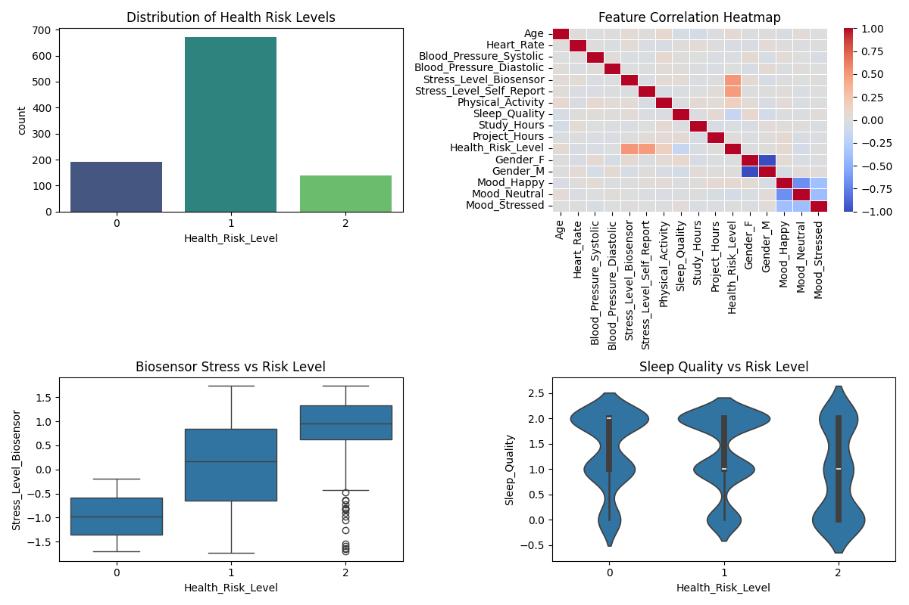

# StudentHealthAssessment360

**From Predictive Analytics to Agentic Health Support**  
An AI-driven platform to monitor, predict, and support student well-being using ML and Agentic AI workflows.

---

## Overview
StudentHealthAssessment360 helps universities proactively manage student health by:  

- **Predicting Risk:** Uses physiological (Heart Rate, BP) and behavioral (Study Hours, Sleep) data to identify at-risk students.  
- **Autonomous Support:** Agentic AI generates personalized intervention plans based on health risk profiles.

---

## System Architecture

### Phase 1 – Predictive Risk Engine
- **Objective:** Multi-class classification of student health risk (Low, Moderate, High)  
- **Stack:** Python, Scikit-Learn, Pandas, Streamlit  
- **Logic:** Preprocess data → Logistic Regression / Random Forest → Risk score  

### Phase 2 – Agentic Support Assistant
- **Objective:** Transform predictions into actionable care  
- **Stack:** LangGraph, ChromaDB, LLM API  
- **Logic:** AI Agent detects high-risk students → queries health guidelines → drafts outreach report

---

## Dataset
**Student Health Dataset**  

- **Physiological:** Heart Rate, Blood Pressure  
- **Behavioral:** Study Hours, Project Hours, Physical Activity  
- **Subjective:** Sleep Quality, Mood, Stress Levels  
- **Target:** Health_Risk_Level  

### Exploratory Data Analysis


---

## Repository Structure
```
StudentHealthAssessment360/
├── data/
│   ├── raw/          # Original dataset
│   └── processed/    # Cleaned/encoded CSVs
├── models/           # Serialized models, scalers, encoders
├── notebooks/        # Research & training notebooks
├── src/
│   ├── app.py        # Streamlit UI
│   ├── agent_logic.py# LangGraph workflows
│   └── utils.py      # Preprocessing helpers
├── requirements.txt  # Dependencies
└── README.md

```

---

## Disclaimer
For educational purposes only. Not a substitute for professional medical advice, diagnosis, or treatment.

---